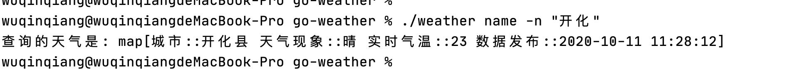
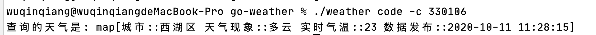

# 通过cobra开发命令行天气查询工具

## 介绍 cobra

`` cobra `` 是一个 `` Golang `` 包，它提供了简单的接口来创建命令行程序。同时它也是一个应用程序，用来生成应用框架，从而开发以 `` cobra `` 为基础的应用。在 `` GitHub `` 上，有更多关于 `` cobra `` 的介绍。网上也有关于此项目的一些文章，只是 10 篇文章到最后可能 9 篇都是重复的，仅此而已。

## 介绍

为了不增加文章的重复率，也为了达到学习的效果，还是通过这个项目来实现一些小功能。最终的效果是通过命令行输入城市名或者城市码获取当前城市的温度情况。




## 实现

入口文件的目的只有一个初始化 `` cobra ``

``` go
func main() {
	_ = cmd.Execute()
}
```

```go
package cmd

import (
	"github.com/spf13/cobra"
)

var (
	weatherCmd = &cobra.Command{
		Use: "weather",
	}
)

func Execute() error {
	return weatherCmd.Execute()
}

```

然后在其他的两个文件中，分别定义了此 `` cmd `` 的两个子命令。分别表示通过城市名称 `` NameCmd `` 和通过城市码 `` CodeCmd ``来查询天气情况。

### 通过城市名称

```go
package cmd

import (
	"errors"
	"fmt"
	"os"

	"github.com/spf13/cobra"
	"github.com/wuqinqiang/go-weather/server"
	"github.com/wuqinqiang/go-weather/tools"
)

func init() {
	NameCmd.PersistentFlags().StringP("name", "n", "", "input city name")
	weatherCmd.AddCommand(NameCmd)
}

var NameCmd = &cobra.Command{
	Use:   "name",
	Short: "check city weather by city name",
	Args: func(cmd *cobra.Command, args []string) error {
		name, err := cmd.Flags().GetString("name")
		if err != nil {
			return errors.New("please input city name")
		}
		if len(name) == 0 {
			return errors.New("请携带参数-n 或者 --name")
		}
		return nil
	},
	Run: func(cmd *cobra.Command, args []string) {
		name, _ := cmd.Flags().GetString("name")
		code := tools.CityMap[name]
		if code == 0 {
			fmt.Println("这个城市我不想查")
			os.Exit(1)
		}
		info, err := server.GetWeather(code)
		if err != nil {
			fmt.Println(err.Error())
			os.Exit(1)
		}
		fmt.Println("查询的天气是:", info)
	},
}

```

### 通过城市码

```go
package cmd

import (
	"errors"
	"fmt"
	"os"

	"github.com/spf13/cobra"
	"github.com/wuqinqiang/go-weather/server"
)

func init() {
	codeCmd.PersistentFlags().IntP("code", "c", 0, "城市码必须是6位的整数")
	weatherCmd.AddCommand(codeCmd)
}

var codeCmd = &cobra.Command{
	Use:   "code",
	Short: "check city weather by city code",
	Args: func(cmd *cobra.Command, args []string) error {
		code, err := cmd.Flags().GetInt("code")
		if err != nil {
			return errors.New("请输入城市码")
		}
		if code == 0 {
			return errors.New("请携带参数-c 或者 --code")
		}
		return nil
	},
	Run: func(cmd *cobra.Command, args []string) {
		code, _ := cmd.Flags().GetInt("code")
		info, err := server.GetWeather(code)
		if err != nil {
			fmt.Println(err.Error())
			os.Exit(1)
		}
		fmt.Println("查询的天气是:", info)
	},
}

```

`` cobra.Command `` 里面的 `` Args `` 主要做一些参数验证，`` Run `` 就是实际工作功能，也是核心部分，大部分命令只会实现这一点。

至于获取天气，你可以看到 `` server.GetWeather `` 其实就是对接高德的 `` api `` 接口，发送了一个 `` http `` 请求罢了。

``` go

const (
	 Key = "xx" //高德key
	Uri = "https://restapi.amap.com/v3/weather/weatherInfo" //api地址
)


//响应天气数据
func GetWeather(code int) (map[string]interface{}, error) {
	info, err := GetWeatherRequest(code)
	if err != nil {
		return nil, err
	}
	infoMap := make(map[string]interface{})
	infoMap["城市:"] = info.Lives[0].City
	infoMap["天气现象:"] = info.Lives[0].Weather
	infoMap["实时气温:"] = info.Lives[0].Temperature
	infoMap["数据发布:"] = info.Lives[0].Reporttime
	return infoMap, nil
}

//请求接口
func GetWeatherRequest(code int) (entity.ResponseInfo, error) {
	info := entity.ResponseInfo{}
	client := &http.Client{Timeout: 2 * time.Second}
	url := fmt.Sprintf(Uri+"?key=%s&city=%d", Key, code)
	resp, err := client.Get(url)
	if err != nil {
		fmt.Println("查询错误:", err)
		return info, errors.New("查询失败")
	}
	defer resp.Body.Close()
	body, err := ioutil.ReadAll(resp.Body)
	if err != nil {
		fmt.Println("read body err:", err)
		return info, errors.New("查询失败")
	}
	if err := json.Unmarshal(body, &info); err != nil {
		fmt.Println("unmarshal response err:", err)
		return info, errors.New("查询失败,请输入正确的城市码")
	}

	if info.Status != "1" {
		return info, errors.New("api 密钥key错误，请检查")
	}
	return info, nil
}
```

这一块没咋么设计，使得获取天气的信息高度依赖于高德的接口，假设我们现在用其他的方式来获取天气，那么就需要大调整当前的代码。这一块理应抽象化。

